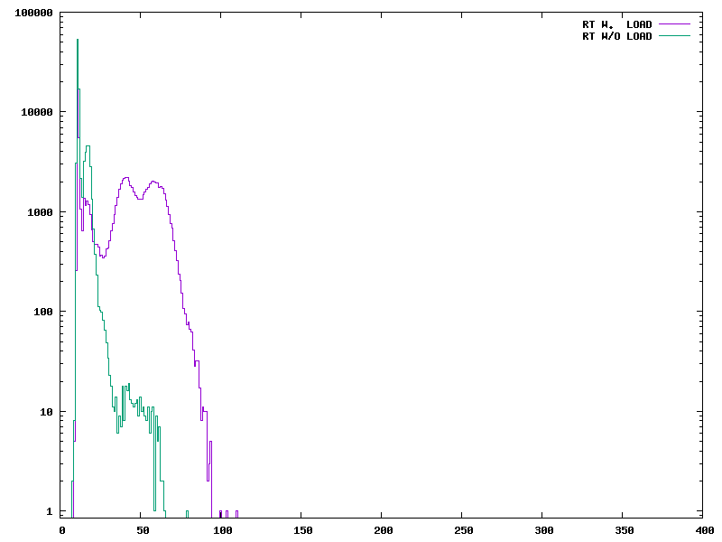

# HW08

This attempted to look at the difference in response times for real- and non-real-time kernels, but I could not get the tests to run on a non-real-time kernel.

This histogram isn't very suprising- there is a near-guaruntee of response time under 100 microseconds, and when there isn't any load, latency is lower.

========================
Professor Yoder's Comments

I wish we could figure out why it won't run some times.

Score:  10/10