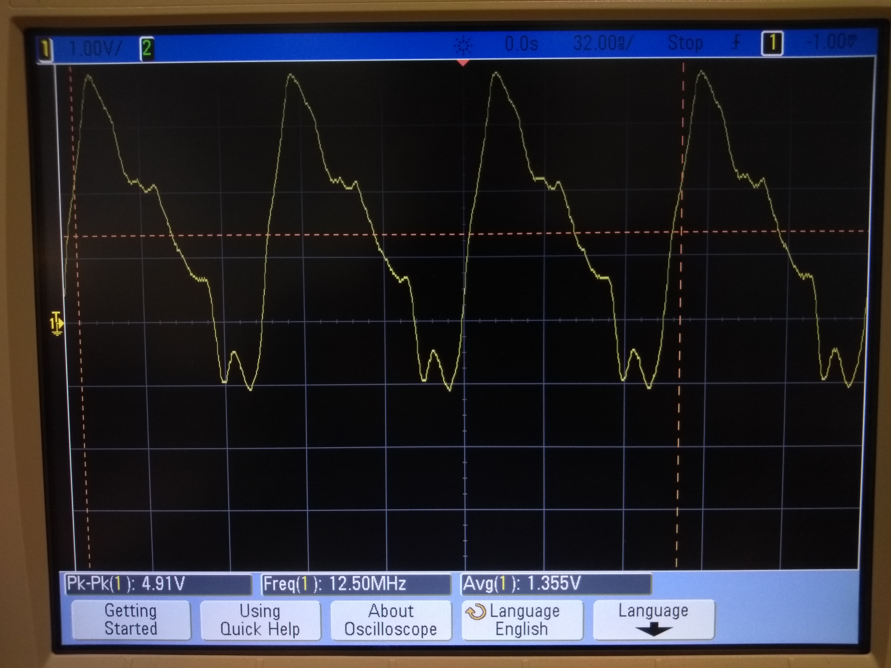
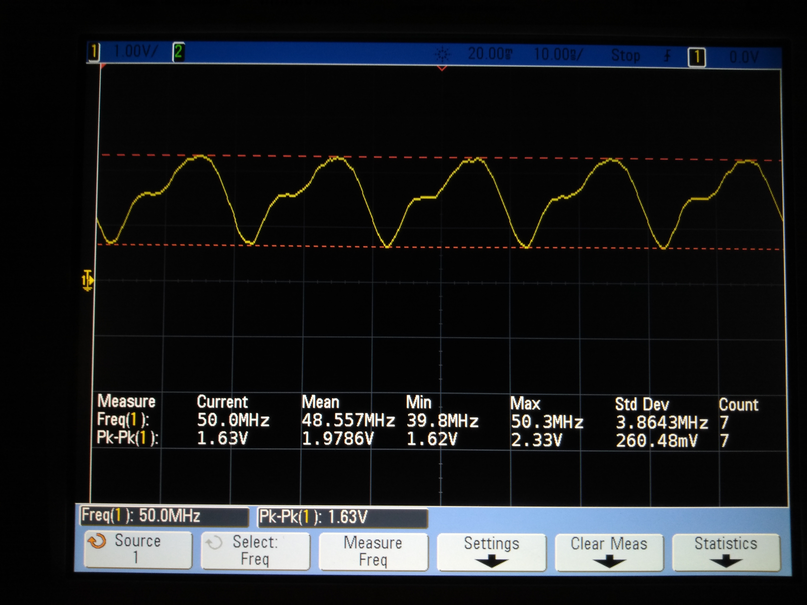
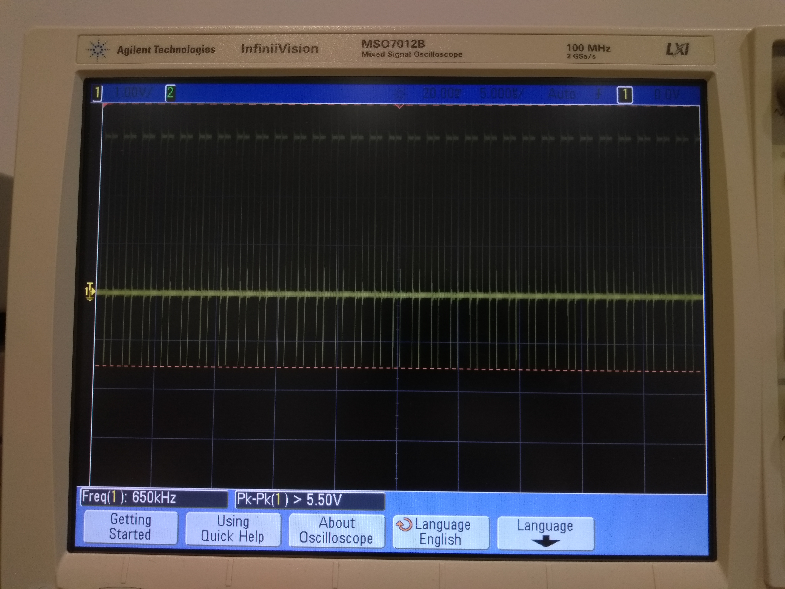
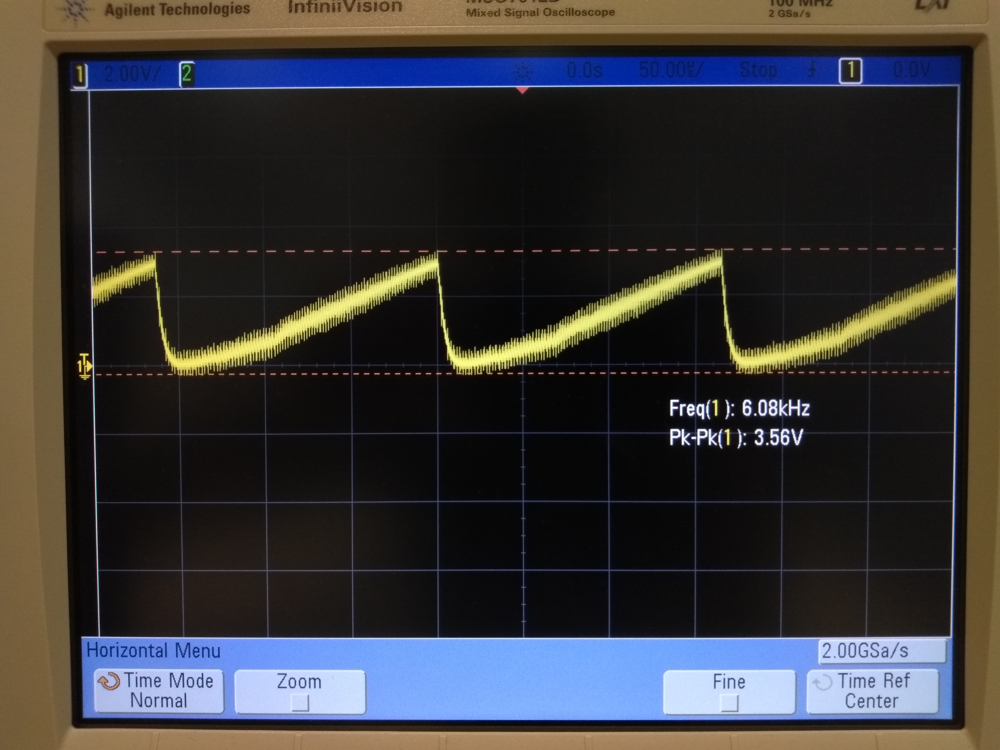
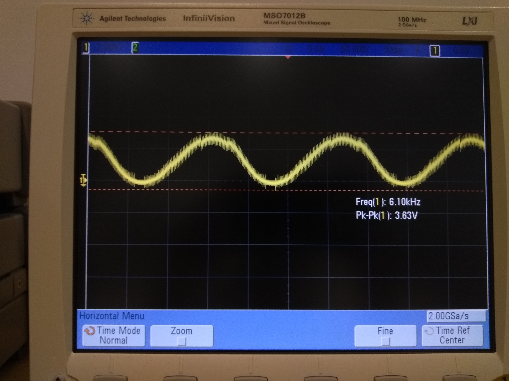

# Usage
Run `. setup.sh <part_number>` (source or `.`, don't just run!), then `make` will build and run the specified part on the correct PRU.

| # |Part     | Result                                                                                | Image                                                         |
| - | ------- | ------------------------------------------------------------------------------------- | ------------------------------------------------------------- |
| 1 | Blink   | The max speed was 12.5 MHz. Jitter was bad (-1.1 to 3.8V), but output is consistent.  |                                    |
| 2 | PWM     | The standard deviation is 3.6 MHz. Jitter exists but isn't very large.                |                                      |
| 3 | mmap    | The highest frequency is 650 kHz and there is significant jitter (+4.9 to -1.1 V).    |                                     |
| 4 | unroll  | Unrolling really speeds things up; all the way to 2.9 MHz!                            |                                                               |
| 5 | reading | The response time is around 50 ns.                                                    |                                                               |
| 6 | analog  | The analog works! I used a 0.1 uf capacitor and the pot turned all the way to 10kOhm. |   |
